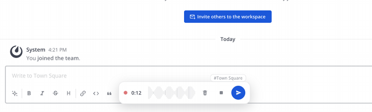

# Voice Notes (Mattermost plugin)

Voice messages for Mattermost. We wanted them in our team chat and the existing options weren't great... the original `mattermost-plugin-voice` has been abandoned since 2022 and doesn't record on modern servers, and the forks that revive it didn't feel good enough to use daily. So I wrote a new one from scratch.

It's a webapp-only plugin (no Go server component), the whole tarball is ~70 KB.



## What it does

- Record from the attachment menu (📎 → *Voice message*), the `/voice` command or the app bar mic icon.
- The audio is encoded to MP3 while you record (mono, 64 kbps), so when you stop there's no wait, the file is already there.
- You can listen and seek before sending, or send directly while recording. Enter sends, Esc cancels (unless you're typing in a text field, your keystrokes are yours).
- Sent notes get an inline player with the real waveform of the recording (the peaks travel in the post props), click/drag to seek, 1×/1.5×/2× playback speed (remembered), and a download link. Only one note plays at a time.
- The note goes to the channel/thread that was active when you opened the recorder, and a chip lets you switch between thread and channel before sending.
- Light/dark theme (Mattermost CSS variables), English and Spanish.
- Posts created by the old `mattermost-plugin-voice` render fine too (same `custom_voice` post type).

A couple of notes on the boring-but-important parts:

- Post props are sender-controlled, so the player sanitizes them before rendering (file id format, peak count and range, duration).
- Capture uses `ScriptProcessorNode` on purpose. AudioWorklet needs its module fetched as a script, and Mattermost's CSP (`script-src 'self'`) blocks `blob:` and `data:` URLs... a webapp-only plugin has no same-origin file to serve, so the deprecated API is the one that actually works everywhere.
- The mobile apps can play the notes (the MP3 goes as a regular attachment) but can't record, Mattermost mobile doesn't run plugin webapp code.

## Requirements

Mattermost Server ≥ 10.0 (we run it on 11.8.x, web and desktop apps).

## Install

Grab the tarball from the releases page and upload it in **System Console → Plugins → Plugin Management**, or from a server shell:

```sh
mmctl plugin add corp.osbren.voicenotes-<version>.tar.gz
mmctl plugin enable corp.osbren.voicenotes
```

Or let the server download it directly, always the latest release:

```sh
mmctl plugin install-url https://github.com/osbren-corp/mattermost-plugin-voice-notes/releases/latest/download/voicenotes.tar.gz
mmctl plugin enable corp.osbren.voicenotes
```

(plugin uploads have to be enabled while installing, `PluginSettings.EnableUploads`)

## Build

```sh
cd webapp && npm ci && cd ..
./package.sh    # → dist/corp.osbren.voicenotes-<version>.tar.gz
```

Pushing a `vX.Y.Z` tag builds and publishes the release automatically.

## License

MIT. MP3 encoding by [@breezystack/lamejs](https://www.npmjs.com/package/@breezystack/lamejs) (LGPL), bundled unmodified.
